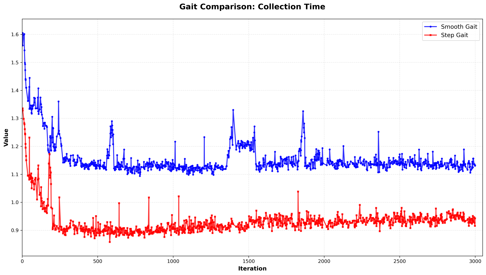

# Influence of different gait reward types on training performance and deployment performance

Two groups are tested:
- **Smooth Gait Function**

    Smooth reward function for gait specification, proposed in [Sim-to-Real Learning of All Common Bipedal Gaits via Periodic Reward Composition](https://arxiv.org/abs/2011.01387), whose gait indicator curves are as follows:

    

- **Step Gait Function**

    Substitute `uniped_periodic_gait` function with a simple step function. Gait indicator curves for this group are shown below:

    

## Training Performance

In simulation, difference between **Smooth Gait Function** group and **Step Gait Function** group is as follows:

- **Step Gait Function** group has faster training speed(fewer collection time), due to fewer operations when computing rewards.

    few

- In the context of single-gait learning, **Step Gait Function** group has higher reward, because of the absence of the ambiguous "-0.5" value in **Smooth Gait Function**.
  
  

